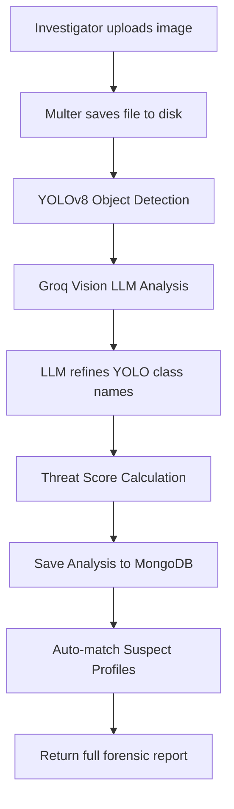
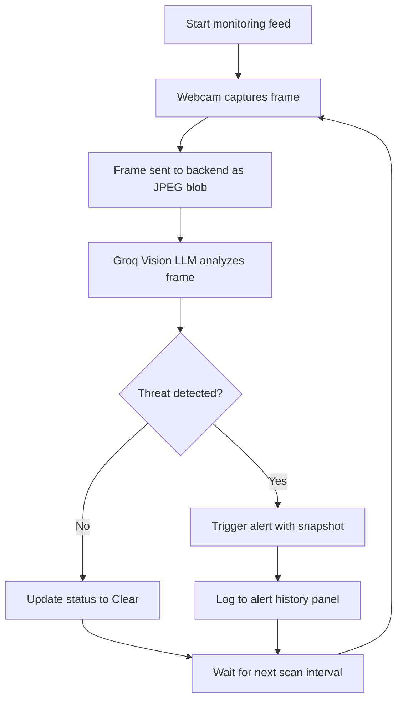
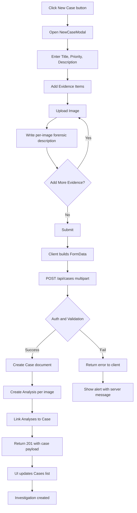

# CrimeLens -- AI-Powered Forensic Crime Scene Investigation Suite

## Project Overview

CrimeLens is a full-stack, AI-powered forensic investigation platform built for real-time crime scene analysis, live surveillance monitoring, and intelligent suspect profiling. Designed with a premium glass-morphism UI, the platform equips investigators with automated threat detection, geospatial crime mapping, and exportable forensic reports -- all from a single web dashboard.

### Core Capabilities

- **Forensic Image Analysis** -- Upload crime scene photos for automated object detection (YOLOv8) combined with AI-powered scene reasoning (Groq Vision LLM) to produce detailed forensic reports.
- **Live Video Monitoring** -- Stream webcam or surveillance camera feeds in real-time. The system captures frames at configurable intervals and sends them to a Vision LLM for instant threat classification (assault, theft, weapons, murder, suspicious activity).
- **Suspect Profiling** -- Automatically cross-references forensic analysis results against a criminal records database, scoring suspects by crime type, weapon match, modus operandi, and geographic proximity.
- **Investigation Management** -- Create, track, and close homicide investigations with multi-evidence uploads, forensic notes, and priority-based workflows.
- **Geospatial Crime Mapping** -- Visualize all analyzed scenes on an interactive Leaflet map centered on the investigator's live location, with cluster detection for crime hotspots.
- **PDF Report Generation** -- One-click export of forensic case reports and live monitoring session reports as downloadable PDFs.

---

## Technology Stack

| Layer | Tech | Purpose |
|-------|------|---------|
| Frontend | React (Vite), Lucide-React, CSS design system | SPA with glassmorphic UI, responsive layouts |
| Styling | Vanilla CSS with CSS custom properties | Threat-level color coding, glass borders, animations |
| Backend | Node.js, Express | REST API, static file serving, middleware pipeline |
| Database | MongoDB (Mongoose ODM) | Document storage for cases, analyses, users, criminal records |
| Object Detection | YOLOv8 microservice (Python, optional) | Real-time bounding-box object detection on uploaded images |
| AI Scene Analysis | Groq SDK with LLaMA 4 Scout Vision model | Forensic scene interpretation, anomaly analysis, threat assessment |
| File Upload | Multer (50 MB limit per file) | Multi-image evidence intake with disk storage |
| Authentication | JWT (Bearer token, 7-day expiry) | Stateless session management with role-based access |
| PDF Export | react-pdf/renderer | Client-side generation of forensic and monitoring reports |
| Maps | React-Leaflet | Interactive crime scene geolocation and cluster visualization |
| Live Camera | react-webcam | Browser-based webcam capture for live monitoring |

---

## Repository Structure

```
CrimeLens/
+-- client/                         # React frontend (Vite)
|   +-- src/
|   |   +-- components/
|   |   |   +-- AnnotatedViewer.jsx     # Canvas overlay for YOLO bounding boxes
|   |   |   +-- CaseCard.jsx            # Case summary card with priority badge
|   |   |   +-- CaseReportPDF.jsx       # PDF template for forensic case reports
|   |   |   +-- DetectionList.jsx       # Tabular display of detected objects
|   |   |   +-- ForensicReport.jsx      # AI-generated forensic narrative display
|   |   |   +-- ImageUploader.jsx       # Drag-and-drop image upload with preview
|   |   |   +-- LiveMonitoringReport.jsx# PDF template for live session reports
|   |   |   +-- LoadingScanner.jsx      # Animated forensic scanning overlay
|   |   |   +-- Navbar.jsx              # Top navigation bar
|   |   |   +-- NewCaseModal.jsx        # Multi-evidence case creation modal
|   |   |   +-- PatternAlert.jsx        # Crime cluster alert badge
|   |   |   +-- StatusDropdown.jsx      # Glass-morphic status filter dropdown
|   |   |   +-- SuspectProfiler.jsx     # Suspect match results with scoring breakdown
|   |   |   +-- ThreatMeter.jsx         # Animated circular threat score gauge
|   |   |   +-- VideoUploader.jsx       # Video upload with frame extraction
|   |   +-- pages/
|   |   |   +-- AnalyzePage.jsx         # Image/video forensic analysis workspace
|   |   |   +-- CaseDetailPage.jsx      # Single case view with evidence gallery
|   |   |   +-- CasesPage.jsx           # Case list with filters and search
|   |   |   +-- CrimeMapPage.jsx        # Interactive Leaflet crime map
|   |   |   +-- DashboardPage.jsx       # Overview stats, threat distribution
|   |   |   +-- LandingPage.jsx         # Public landing / login page
|   |   |   +-- LiveMonitoringPage.jsx  # Real-time webcam surveillance feed
|   |   +-- services/
|   |   |   +-- api.js                  # Axios instance, auth interceptor, service wrappers
|   |   +-- index.css                   # Global design system (CSS variables, utilities)
|   +-- vite.config.js
+-- server/                         # Express backend
|   +-- src/
|   |   +-- controllers/
|   |   |   +-- analysisController.js   # Image analysis, live monitoring, suspect matching
|   |   |   +-- authController.js       # Login, register, getMe
|   |   |   +-- caseController.js       # CRUD for investigations, evidence linking, notes
|   |   +-- models/
|   |   |   +-- Analysis.js             # Forensic analysis schema (detections, reports, geolocation)
|   |   |   +-- Case.js                 # Investigation schema (status, priority, evidence refs)
|   |   |   +-- CriminalRecord.js       # Criminal database (crimes, MO, weapons, location)
|   |   |   +-- User.js                 # User schema (bcrypt hashed passwords, roles)
|   |   +-- routes/
|   |   |   +-- analysisRoutes.js       # /api/analysis endpoints
|   |   |   +-- authRoutes.js           # /api/auth endpoints
|   |   |   +-- caseRoutes.js           # /api/cases endpoints (Multer configured)
|   |   +-- middleware/
|   |   |   +-- auth.js                 # JWT verification middleware
|   |   +-- services/
|   |   |   +-- geminiService.js        # Groq Vision LLM integration (scene + live analysis)
|   |   |   +-- yoloService.js          # YOLOv8 Python microservice client (with mock fallback)
|   |   |   +-- scoringService.js       # Composite threat scoring engine
|   |   |   +-- suspectService.js       # Criminal record matching algorithm
|   |   +-- server.js                   # Express bootstrap, MongoDB connection, static serving
|   +-- uploads/                        # Persisted forensic images (auto-created on start)
+-- README.md
```

---

## Getting Started

### Prerequisites

- Node.js >= 18
- npm (or yarn)
- MongoDB (local or remote URI)
- Groq API key (for AI analysis features)
- (Optional) Python 3.10+ with Ultralytics for the YOLOv8 microservice

### Installation

```bash
# Clone the repository
git clone https://github.com/yourusername/CrimeLens.git
cd CrimeLens

# Install server dependencies
cd server && npm install && cd ..

# Install client dependencies
cd client && npm install && cd ..
```

### Environment Variables

Create a `.env` file in `server/`:

```env
MONGODB_URI=mongodb://localhost:27017/crimelens
JWT_SECRET=your_secret_key
PORT=5000
GROQ_API_KEY=gsk_your_groq_api_key
GROQ_MODEL=meta-llama/llama-4-scout-17b-16e-instruct
YOLO_SERVICE_URL=http://localhost:5001
```

### Running the Application

```bash
# Terminal 1 -- Start the backend
cd server
npm run dev

# Terminal 2 -- Start the frontend
cd client
npm run dev
```

The frontend runs at `http://localhost:5173` and the API at `http://localhost:5000`.

---

## How Detection and Analysis Works

CrimeLens uses a multi-stage AI pipeline that combines object detection with vision-language reasoning. The pipeline operates in two distinct modes: **static forensic analysis** (uploaded images/videos) and **live monitoring** (real-time webcam feeds).

### Static Forensic Analysis Pipeline

When an investigator uploads a crime scene image, the system executes a four-stage analysis:



**Stage 1 -- Object Detection (YOLOv8)**
The uploaded image is forwarded to a YOLOv8 Python microservice running on port 5001. The service returns a list of detected objects with bounding boxes, class labels, confidence scores, and object categories (people, weapons, objects). If the YOLO service is unavailable, the system falls back to mock detections to maintain UI continuity.

**Stage 2 -- AI Scene Reasoning (Groq Vision LLM)**
The image is base64-encoded and sent to the Groq API alongside the YOLO detection context. The LLM (LLaMA 4 Scout 17B, a multimodal vision model) receives a forensic analysis prompt and returns a structured JSON report containing:

- Scene overview (3-5 sentence narrative)
- Detected elements with forensic significance
- Refined class names (correcting YOLO hallucinations, e.g., misidentified objects)
- Anomaly analysis
- Forensic interpretation (reconstructed narrative of events)
- Threat assessment (level + score + contributing factors)
- Recommended investigation actions
- Crime type classification

**Stage 3 -- Threat Scoring**
A composite threat score (0-100) is calculated by the `scoringService` using a weighted formula:

| Factor | Max Weight | Description |
|--------|-----------|-------------|
| Weapon presence | 25 pts per weapon | Detection of knives, guns, rifles, axes, etc. |
| Weapon confidence | 15 pts scaled | Higher confidence yields more points |
| Suspicious objects | 15 pts each | Blood, fire, smoke, masks, crowbars |
| Gemini threat assessment | 60% weight | LLM scene-level reasoning score |
| Anomaly count | 3 pts each | Number of anomalies identified |

The score maps to a threat level: CRITICAL (80+), HIGH (60-79), MEDIUM (40-59), LOW (20-39), MINIMAL (0-19).

**Stage 4 -- Suspect Profiling**
Immediately after analysis, the system queries the `CriminalRecord` collection and scores each suspect against the forensic findings:

- **Crime type match** (up to 35 pts) -- fuzzy matching with alias mapping (e.g., "assault" matches "attack", "battery", "violence")
- **Weapon match** (up to 25 pts) -- detected weapons cross-referenced with suspect's known weapons
- **Modus operandi** (up to 20 pts) -- keyword matching against the forensic text
- **Geographic proximity** (up to 15 pts) -- Haversine distance between scene and suspect's last known location (within 10km)
- **Status bonus** (up to 5 pts) -- "wanted" suspects score higher than "released"

The top 5 suspects are returned, ranked by composite match score.

### Live Monitoring Pipeline

The Live Intelligence page provides real-time surveillance analysis using the investigator's webcam or any connected camera.



**How it works:**

1. The frontend captures a JPEG screenshot from the webcam at a configurable interval (1-5 seconds, adjustable via a slider).
2. Each frame is sent as `multipart/form-data` to `POST /api/analysis/monitor`.
3. The backend base64-encodes the frame and sends it to the Groq Vision LLM with a specialized prompt that checks for: fighting, assault, theft, weapons, injured persons, and other criminal activity.
4. The LLM responds with a JSON classification: `alert` (boolean), `crimeType` (Attack / Theft / Murder / Weapons / Suspicious / None), `confidence` (0-100), `description`, and `recommendedAction`.
5. A **safety override** on the server ensures that if the LLM detects a critical crime type (Attack, Murder, Theft, Weapons) with confidence above 40% but fails to set `alert: true`, the system forces the alert.
6. Alerts are displayed in a real-time threat panel with timestamps, crime type, descriptions, and recommended actions. Each alert captures a snapshot of the triggering frame.
7. The frame file is cleaned up from disk after processing to prevent storage buildup.
8. If the API rate limit is hit, monitoring automatically pauses and the investigator is notified.
9. At any point, the investigator can download a **PDF session report** containing all detected threats with their snapshots.

### Video Analysis

Investigators can also upload pre-recorded video files. The `VideoUploader` component extracts key frames from the video, sends each frame through the static analysis pipeline individually, and presents the results as an interactive timeline. Each frame shows its own threat level, detections, and forensic report. The investigator can click through frames to review the analysis progression.

---

## API Reference

All endpoints are prefixed with `/api` and require a valid JWT Bearer token (except login and register).

### Authentication -- `/api/auth`

| Method | Endpoint | Description |
|--------|----------|-------------|
| POST | /login | Authenticate with email and password, returns JWT |
| POST | /register | Create a new investigator account, returns JWT |
| GET | /me | Get current authenticated user profile |

### Analysis -- `/api/analysis`

| Method | Endpoint | Description |
|--------|----------|-------------|
| POST | /analyze | Upload image for full forensic analysis (YOLO + LLM + scoring) |
| POST | /monitor | Send a webcam frame for live threat classification |
| GET | / | List all analyses (paginated, filterable by threat level) |
| GET | /stats | Dashboard statistics (threat distribution, top objects, averages) |
| GET | /patterns | Detect geographic crime clusters within 2km radius |
| GET | /:id | Get a specific analysis with full report |
| GET | /:id/suspects | Get suspect matches for a specific analysis |

### Cases -- `/api/cases`

| Method | Endpoint | Description |
|--------|----------|-------------|
| GET | / | List all cases (filterable by status, priority, search) |
| POST | / | Create new investigation with multi-image evidence upload |
| GET | /:id | Get case detail with populated analyses and creator info |
| PUT | /:id | Update case fields (status, priority, optional image) |
| DELETE | /:id | Delete a case |
| POST | /:id/evidence | Link an existing analysis to the case |
| POST | /:id/notes | Add a forensic note to the case |

---

## Data Models

### User

```js
{
  name: String,
  email: { type: String, unique: true },
  password: String,                    // bcrypt hashed
  role: ['investigator', 'admin']      // default: 'investigator'
}
```

### Case (Investigation)

```js
{
  title: { type: String, required: true },
  description: String,
  status: ['open', 'investigating', 'closed'],
  priority: ['critical', 'high', 'medium', 'low'],
  imageUrl: String,                    // featured image (first evidence)
  analyses: [ObjectId -> Analysis],
  notes: [{ content: String, createdAt: Date }],
  createdBy: ObjectId -> User
}
```

### Analysis (Forensic Evidence)

```js
{
  imageUrl: String,
  originalFilename: String,
  detections: [{
    class: String,
    confidence: Number,
    category: String,                  // 'people', 'weapons', 'objects'
    bbox: { x, y, w, h }
  }],
  forensicReport: {
    sceneOverview: String,
    detectedElements: [String],
    anomalyAnalysis: [String],
    forensicInterpretation: String,
    threatAssessment: { level, score, factors },
    recommendedActions: [String],
    crimeType: String,
    confidence: Number
  },
  threatScore: Number,                 // 0-100
  threatLevel: ['CRITICAL','HIGH','MEDIUM','LOW','MINIMAL'],
  location: { type: 'Point', coordinates: [lng, lat] },
  analyzedBy: ObjectId -> User,
  caseId: ObjectId -> Case
}
```

### Criminal Record (Suspect Database)

```js
{
  name: String,
  alias: String,
  age: Number,
  gender: ['Male', 'Female', 'Other'],
  photo: String,
  knownCrimes: [{ crimeType, date, description, location, convicted }],
  modusOperandi: [String],
  associatedWeapons: [String],
  lastKnownLocation: { type: 'Point', coordinates: [lng, lat] },
  status: ['wanted', 'incarcerated', 'released', 'under_surveillance'],
  dangerLevel: ['extreme', 'high', 'moderate', 'low'],
  physicalDescription: { height, weight, distinguishingMarks }
}
```

---

## Frontend Pages

| Page | Description |
|------|-------------|
| **LandingPage** | Public entry point with login/register |
| **DashboardPage** | Overview statistics: total analyses, threat distribution, recent activity |
| **AnalyzePage** | Upload images or videos for forensic analysis; shows annotated bounding boxes, detections list, threat meter, forensic report, and suspect profiler |
| **LiveMonitoringPage** | Real-time webcam surveillance with configurable scan interval, threat alerts panel, session PDF export, and multi-camera support |
| **CasesPage** | List all investigations with status/priority filters and search; create new cases via modal |
| **CaseDetailPage** | Detailed case view with evidence gallery, analysis results, and forensic notes |
| **CrimeMapPage** | Interactive Leaflet map centered on user location, showing analyzed scenes as pins with threat-level coloring |

---

## Workflow: Creating a New Investigation



- Each uploaded image becomes an individual Analysis record with its own forensic description.
- The first image is set as the featured case thumbnail.
- The backend validates the JWT; a missing or expired token returns 401.

---

## Design System

The UI uses a custom CSS variable system for consistent theming across all components:

```css
:root {
  --bg-primary: #0a0a0f;
  --glass-bg: rgba(255, 255, 255, 0.03);
  --glass-border: rgba(255, 255, 255, 0.12);
  --radius-md: 12px;

  --threat-critical: #ef4444;
  --threat-high: #f97316;
  --threat-medium: #eab308;
  --threat-low: #22c55e;
  --threat-minimal: #06b6d4;

  --accent-cyan: #06b6d4;
  --accent-purple: #a855f7;
  --text-primary: #f5f5f5;
  --text-muted: #999;
}
```

---

## Security

- JWT is verified on every request by the auth middleware.
- All API routes (except login/register) are protected with `authMiddleware`.
- Passwords are hashed with bcrypt before storage.
- Uploaded files are stored in a dedicated `uploads/` directory outside the source tree and served read-only via Express static middleware.
- Live monitoring frames are deleted from disk immediately after AI processing to prevent storage buildup.

---

## Future Enhancements

- Deploy the YOLOv8 microservice as a containerized sidecar for production-grade object detection.
- Implement real-time WebSocket push for multi-investigator collaboration.
- Add role-based dashboards (admin oversight vs. field investigator view).
- Export complete case bundles (PDF + evidence images) for courtroom presentation.
- Implement full unit and integration test coverage (Jest, Supertest).
- Add face recognition integration for suspect photo matching.

---

## License

This project is open-source and available under the MIT License.
